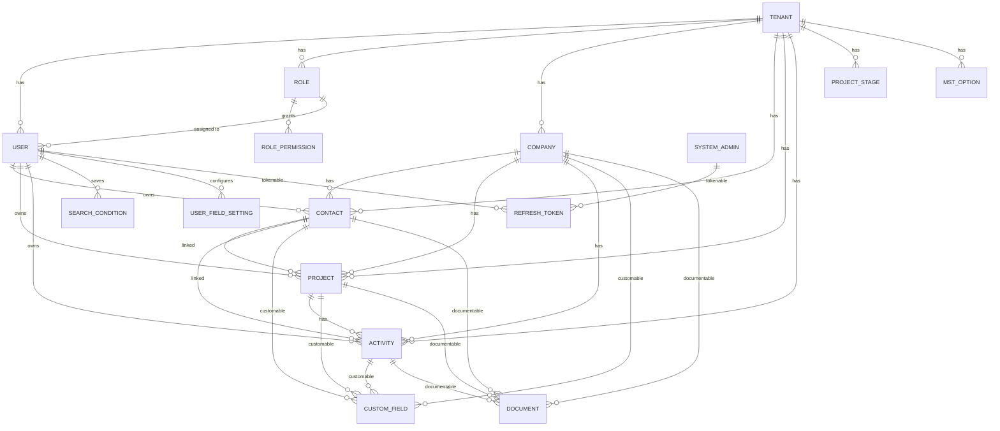
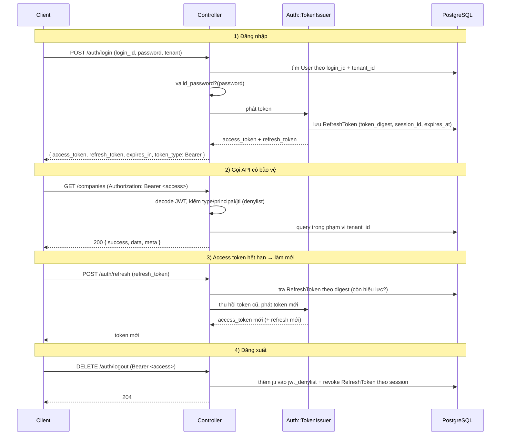
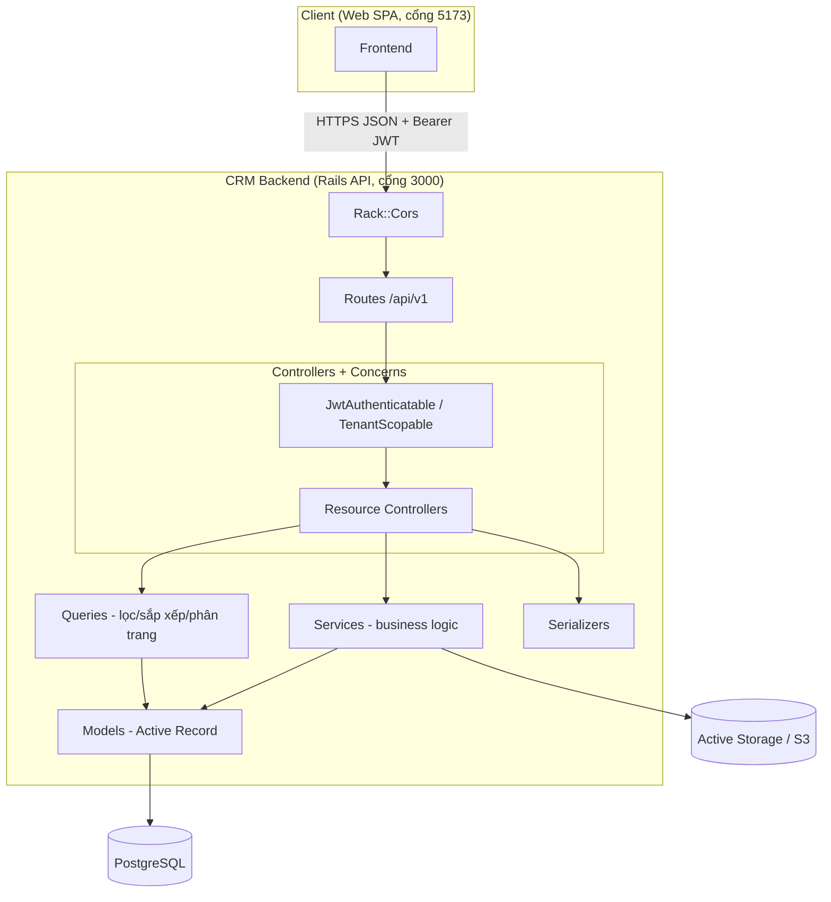
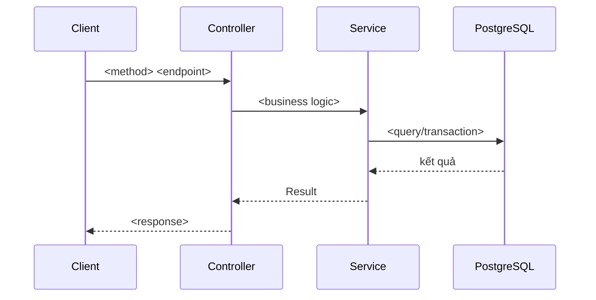

# CRM Backend — Tài liệu Kiến trúc

> Tài liệu mô tả **hiện trạng** của Backend (BE): công nghệ, cấu trúc thư mục, các tầng, sơ đồ luồng và sơ đồ dữ liệu.
> Mục đích: dùng làm "bản đồ" để nắm hệ thống hiện tại, đồng thời làm nền để **vẽ thêm luồng / mô tả cấu trúc tương lai** (xem mục cuối).
>
> Cập nhật lần cuối: 2026-06-09 · Nhánh: `main`

---

## 1. Tổng quan

CRM Backend là một **API service đa người thuê (multi-tenant SaaS)** phục vụ quản lý quan hệ khách hàng:
quản lý **Công ty (Company) → Liên hệ (Contact) → Dự án/Cơ hội bán hàng (Project) → Hoạt động (Activity)**.

Hai luồng xác thực tách biệt:
- **User** (người dùng thuộc một tenant) — thao tác nghiệp vụ CRM.
- **System Admin** (quản trị toàn hệ thống) — quản trị xuyên tenant.

---

## 2. Công nghệ (Tech Stack)

| Hạng mục | Lựa chọn |
|---|---|
| Ngôn ngữ | Ruby 3.4.9 |
| Framework | Rails 8.1 (chế độ **API-only**) |
| CSDL | PostgreSQL (extensions: `pg_trgm` cho tìm kiếm mờ) |
| Web server | Puma (mặc định cổng `3000`) |
| Xác thực | Devise + devise-jwt (JWT access/refresh token) |
| Mã hoá mật khẩu | bcrypt |
| Tài liệu API | Rswag (OpenAPI / Swagger UI tại `/api-docs`) |
| Phân trang | Pagy |
| CORS | rack-cors |
| Cache / Queue / Cable | Solid Cache, Solid Queue, Solid Cable |
| Lưu file | Active Storage (+ service S3) |
| Triển khai | Kamal (container) / Dockerfile |
| Chất lượng mã | RuboCop (Rails Omakase), Brakeman |

---

## 3. Cấu trúc thư mục

```
crm_be/
├── app/
│   ├── controllers/
│   │   ├── api/v1/
│   │   │   ├── base_controller.rb              # Base: auth + response + error + tenant scope
│   │   │   ├── auth/sessions_controller.rb     # User: login / refresh / logout
│   │   │   ├── me_controller.rb                # User: profile + đổi mật khẩu
│   │   │   ├── companies_controller.rb         # CRUD + tìm kiếm/lọc
│   │   │   ├── contacts_controller.rb
│   │   │   ├── projects_controller.rb          # CRUD + change_stage
│   │   │   ├── activities_controller.rb
│   │   │   ├── user_field_settings_controller.rb
│   │   │   ├── search_conditions_controller.rb
│   │   │   ├── mst_options_controller.rb
│   │   │   ├── user/companies_controller.rb    # thao tác công ty theo phạm vi user
│   │   │   └── admin/                          # Admin: auth/sessions, me
│   │   └── concerns/                           # "Middleware" cấp controller (xem mục 6)
│   │       ├── jwt_authenticatable.rb          # xác thực User
│   │       ├── jwt_admin_authenticatable.rb    # xác thực SystemAdmin
│   │       ├── api_response.rb                 # định dạng envelope JSON
│   │       ├── api_error_handler.rb            # rescue lỗi tập trung
│   │       ├── tenant_scopable.rb              # cô lập dữ liệu theo tenant
│   │       ├── service_result_handler.rb       # chuyển Result của service → HTTP
│   │       └── paginatable.rb
│   │
│   ├── services/                              # Tầng nghiệp vụ (business logic)
│   │   ├── base_service.rb                    # định nghĩa Result(success?, data, errors)
│   │   ├── auth/token_issuer.rb               # phát/làm mới/thu hồi token
│   │   ├── json_web_token.rb                  # encode/decode JWT
│   │   ├── companies/{create,update}_service.rb
│   │   ├── projects/{create,change_stage}_service.rb
│   │   ├── documents/s3_storage_service.rb
│   │   └── user_field_settings/bulk_update_service.rb
│   │
│   ├── queries/                              # Tầng truy vấn: lọc + sắp xếp + phân trang
│   │   ├── base_query.rb
│   │   └── {company,contact,project,activity}_query.rb
│   │
│   ├── serializers/                          # Định dạng dữ liệu trả về
│   │   ├── base_serializer.rb
│   │   └── {company,contact,project,activity,user}_serializer.rb
│   │
│   ├── models/                               # Active Record (xem mục 7 ERD)
│   ├── jobs/                                  # Background jobs (Solid Queue)
│   └── mailers/
│
├── config/
│   ├── routes.rb                             # định nghĩa route (mục 5)
│   ├── application.rb                        # api_only = true
│   ├── database.yml                          # PostgreSQL + Solid schemas
│   ├── puma.rb
│   └── initializers/{cors,devise,pagy,rswag_*}.rb
│
├── db/
│   ├── schema.rb                             # nguồn chân lý về cấu trúc bảng
│   ├── migrate/                              # các migration
│   └── seeds.rb                              # dữ liệu demo (tenant/user/admin)
│
├── swagger/v1/swagger.yaml                   # đặc tả OpenAPI
├── .env-example                             # biến môi trường mẫu
├── Dockerfile · Gemfile · README.md
└── docs/ARCHITECTURE.md                      # ← tài liệu này
```

---

## 4. Mô hình phân tầng (Layered Architecture)

Mỗi request đi qua các tầng có trách nhiệm rõ ràng:

```
HTTP Request
   │
   ▼
[Routes]  config/routes.rb — định tuyến /api/v1/...
   │
   ▼
[Controller]  before_action: authenticate_user! → set_current_tenant!
   │           (kiểm tra JWT, xác định tenant hiện tại)
   ▼
[Query]  (với GET list)  lọc + sắp xếp + phân trang theo whitelist cột
   │
   ▼
[Service]  business logic + transaction, trả về Result(success?, data, errors)
   │
   ▼
[Model]  Active Record: validation, association, scope theo tenant_id
   │
   ▼
[Serializer]  chuyển record → Hash JSON (kèm custom_fields)
   │
   ▼
[ApiResponse]  bọc thành envelope { success, data, message, meta }
   │
   ▼
HTTP Response (JSON)
```

**Nguyên tắc:**
- Controller **mỏng** — chỉ điều phối; không chứa logic nghiệp vụ.
- Logic nghiệp vụ nằm ở **Service** (ghi/biến đổi dữ liệu) và **Query** (đọc/lọc danh sách).
- Mọi truy vấn dữ liệu nghiệp vụ đều được **giới hạn theo `tenant_id`** (cô lập đa người thuê).

---

## 5. API Endpoints

Base URL: `http://localhost:3000/api/v1`
Tài liệu tương tác: `http://localhost:3000/api-docs`

### User (theo tenant)

| Method | Endpoint | Auth | Mô tả |
|---|---|---|---|
| POST | `/auth/login` | — | Đăng nhập, phát access + refresh token |
| POST | `/auth/refresh` | — | Làm mới access token |
| DELETE | `/auth/logout` | User JWT | Đăng xuất, thu hồi token |
| GET | `/me` | User JWT | Thông tin user hiện tại |
| PATCH | `/me/change_password` | User JWT | Đổi mật khẩu |
| GET/POST/PATCH/DELETE | `/companies(/:id)` | User JWT | CRUD công ty |
| GET/POST/PATCH/DELETE | `/contacts(/:id)` | User JWT | CRUD liên hệ |
| GET/POST/PATCH/DELETE | `/projects(/:id)` | User JWT | CRUD dự án |
| PATCH | `/projects/:id/change_stage` | User JWT | Chuyển giai đoạn dự án |
| GET/POST/PATCH/DELETE | `/activities(/:id)` | User JWT | CRUD hoạt động |
| GET | `/user_field_settings` | User JWT | Lấy cấu hình hiển thị cột |
| PATCH | `/user_field_settings/bulk_update` | User JWT | Cập nhật hàng loạt |
| GET/POST/DELETE | `/search_conditions(/:id)` | User JWT | Bộ lọc tìm kiếm đã lưu |
| GET/POST/PATCH | `/mst_options(/:id)` | User JWT | Dữ liệu master (option) |
| GET/POST/PATCH/DELETE | `/user/companies(/:id)` | User JWT | Công ty theo phạm vi user |

### Admin (toàn hệ thống)

| Method | Endpoint | Auth | Mô tả |
|---|---|---|---|
| POST | `/admin/auth/login` | — | Đăng nhập admin |
| POST | `/admin/auth/refresh` | — | Làm mới token admin |
| DELETE | `/admin/auth/logout` | Admin JWT | Đăng xuất admin |
| PATCH | `/admin/auth/change_password` | Admin JWT | Đổi mật khẩu admin |
| GET | `/admin/me` | Admin JWT | Thông tin admin hiện tại |
| PATCH | `/admin/me/change_password` | Admin JWT | Đổi mật khẩu |

---

## 6. "Middleware" cấp controller (Concerns)

Rails API không dùng middleware truyền thống cho từng nghiệp vụ; thay vào đó dùng **concern** gắn vào `BaseController`:

| Concern | Vai trò |
|---|---|
| `JwtAuthenticatable` | Lấy Bearer token → decode JWT → kiểm `type=access`, `principal_type=User` → set `@current_user` |
| `JwtAdminAuthenticatable` | Tương tự cho `SystemAdmin` → set `@current_system_admin` |
| `TenantScopable` | Set `@current_tenant`; cung cấp `tenant_scope(Model)` để tự lọc theo `tenant_id` |
| `ApiResponse` | Chuẩn hoá envelope: `render_success`, `render_error`, `render_created` |
| `ApiErrorHandler` | Rescue `RecordNotFound` (404), `RecordInvalid` (422), `ParameterMissing` (400), `StandardError` (500) |
| `ServiceResultHandler` | Chuyển `Result` của service thành HTTP response + serialize |
| `Paginatable` | Tiện ích phân trang (Pagy) |

Ngoài ra ở tầng Rack: **`Rack::Cors`** xử lý CORS (origin lấy từ `CORS_ORIGINS`).

---

## 7. Cơ sở dữ liệu — Sơ đồ thực thể (ERD)

`Tenant` là gốc cô lập dữ liệu; gần như mọi bảng nghiệp vụ đều có `tenant_id`.
`Document` và `CustomField` là quan hệ **đa hình (polymorphic)** — gắn được vào nhiều loại thực thể.



### Bảng chính

| Bảng | Vai trò | Khoá ngoại chính |
|---|---|---|
| `tenants` | Gốc đa người thuê (`login_code`, `name`, `is_active`) | — |
| `users` | Người dùng tenant (`login_id` unique theo tenant) | `tenant_id`, `role_id` |
| `system_admins` | Quản trị toàn hệ thống (`login_code`) | — |
| `roles` / `role_permissions` | Phân quyền (`permission_key` JSON, `full_permission`) | `tenant_id` / `role_id` |
| `companies` | Công ty/khách hàng tiềm năng | `tenant_id` |
| `contacts` | Người liên hệ thuộc công ty | `tenant_id`, `company_id`, `user_id` |
| `projects` | Dự án/cơ hội bán hàng (`status`, `accuracy`) | `tenant_id`, `company_id`, `contact_id`, `user_id` |
| `project_stages` | Giai đoạn dự án | `tenant_id` |
| `activities` | Hoạt động/tương tác (cuộc gọi, hẹn gặp…) | `tenant_id`, `company_id`, `contact_id`, `project_id`, `user_id` |
| `documents` | File đính kèm (đa hình + Active Storage) | `tenant_id`, `user_id`, `documentable_*` |
| `custom_fields` | Thuộc tính tuỳ biến (đa hình) | `customable_*` |
| `user_field_settings` | Hiển thị/thứ tự cột theo user | `tenant_id`, `user_id` |
| `search_conditions` | Bộ lọc tìm kiếm đã lưu (`filter_params` JSON) | `tenant_id`, `user_id` |
| `mst_options` | Dữ liệu master (option_type) | `tenant_id` |
| `refresh_tokens` | Refresh token (đa hình, lưu `token_digest`, `session_id`) | `tokenable_*` |
| `jwt_denylist` | Danh sách JWT bị thu hồi (theo `jti`) | — |

---

## 8. Luồng xác thực (Authentication Flow)

Hệ thống dùng cặp **access token (ngắn hạn) + refresh token (dài hạn)**.
Mặc định: access TTL 15 phút (`JWT_ACCESS_TOKEN_TTL_MINUTES`), refresh TTL 7 ngày (`JWT_REFRESH_TOKEN_TTL_DAYS`).

### Đăng nhập + gọi API + làm mới token



**Thành phần JWT payload:** `user_id` (hoặc `system_admin_id`), `principal_type`, `type` (access/refresh), `sid` (session), `jti` (định danh để thu hồi), `exp`.

---

## 9. Cấu hình & Môi trường

Biến môi trường (xem `.env-example`):

```bash
DATABASE_USERNAME=postgres
DATABASE_PASSWORD=password
DATABASE_HOST=localhost
DATABASE_PORT=5432
JWT_SECRET_KEY=...
JWT_ACCESS_TOKEN_TTL_MINUTES=15
JWT_REFRESH_TOKEN_TTL_DAYS=7
CORS_ORIGINS=http://localhost:5173
```

Khởi chạy nhanh:

```bash
bundle install
bin/rails db:prepare    # tạo DB + load schema
bin/rails db:seed       # dữ liệu demo (tenant DEMO001, user admin/password, sysadmin)
bin/rails server        # http://localhost:3000
```

Tài khoản demo (từ `db/seeds.rb`): tenant `DEMO001` · user `admin`/`password` · system admin `sysadmin`/`password`.

---

## 10. Sơ đồ tổng thể hệ thống (hiện tại)



---

## 11. Khu vực để mở rộng cho TƯƠNG LAI

> Phần này để trống có chủ đích — dùng để **vẽ thêm luồng và mô tả cấu trúc dự kiến**.
> Gợi ý các nhánh nên bổ sung khi thiết kế tiếp:

- [ ] **Phân quyền (Authorization):** hiện đã có `roles` / `role_permissions` nhưng **chưa thực thi** ở controller. Bổ sung luồng kiểm tra `permission_key` trước mỗi action.
- [ ] **Background jobs:** mô tả các job (gửi mail, đồng bộ, export) chạy qua Solid Queue.
- [ ] **Upload tài liệu:** vẽ luồng đầy đủ `documents` + Active Storage + S3 (`Documents::S3StorageService`).
- [ ] **Audit log / lịch sử thay đổi:** chưa có — cân nhắc bảng `audit_logs`.
- [ ] **Thông báo (notifications):** real-time qua Solid Cable nếu cần.
- [ ] **Báo cáo / Dashboard:** tầng aggregate/report tách riêng.
- [ ] **Quản trị tenant (Admin):** mở rộng các endpoint `/admin/*` để CRUD tenant, user, role.
- [ ] **Rate limiting / API throttling** ở tầng Rack.

### Mẫu sơ đồ luồng mới (copy để chỉnh)


