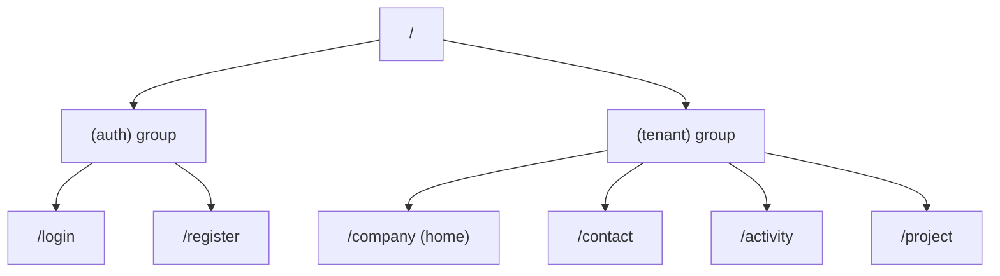
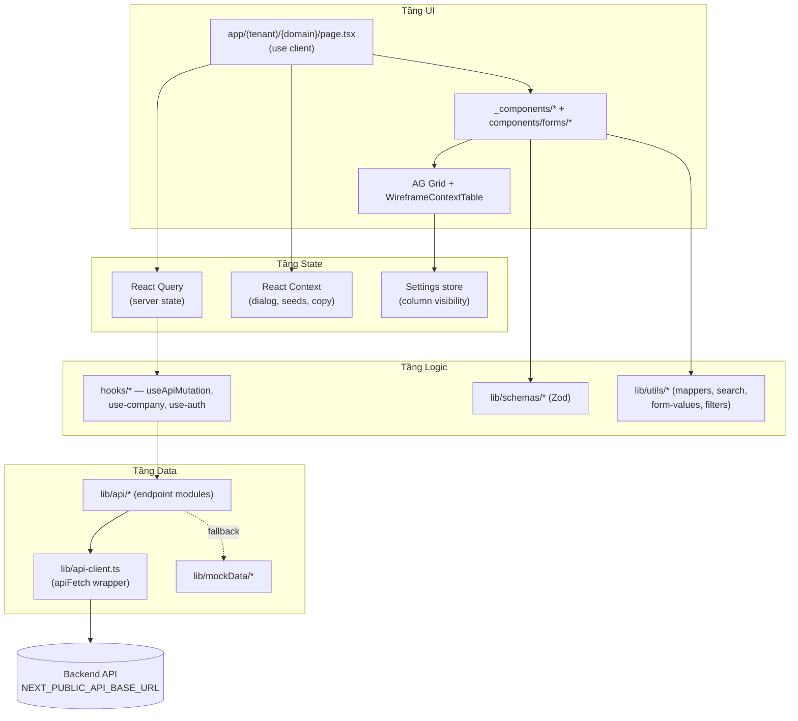
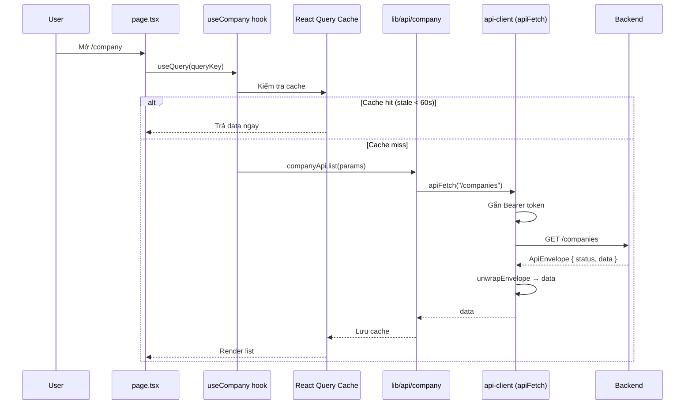
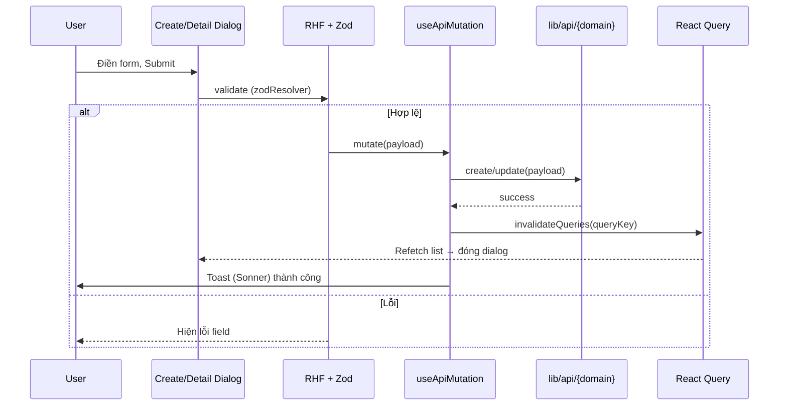
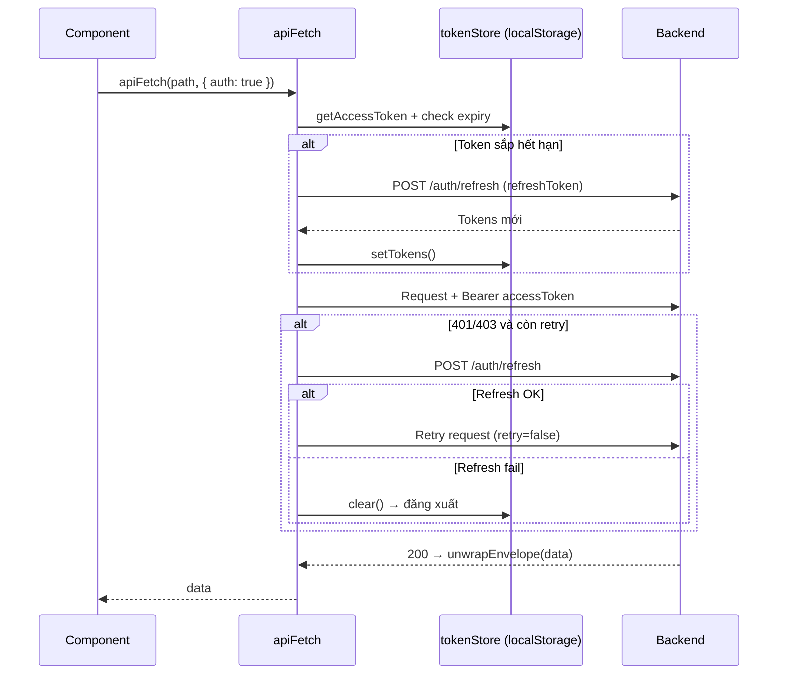

# CRM Frontend — Tài liệu Kiến trúc

> Mục đích: Nắm bắt hiện trạng (tech stack, cấu trúc thư mục, luồng dữ liệu) của FE để làm nền tảng thiết kế, vẽ thêm luồng và mở rộng cho tương lai.
>
> - **Cập nhật:** 2026-06-09
> - **Phạm vi:** Toàn bộ ứng dụng FE tại `/home/manhamcolab/Crm_Fe`

---

## 1. Tổng quan

CRM Frontend là một ứng dụng **Next.js 16 (App Router)** dùng cho hệ thống quản lý quan hệ khách hàng. Ứng dụng tổ chức theo 4 nghiệp vụ chính: **Company, Contact, Activity, Project**, với giao diện dạng list + detail và lưới dữ liệu enterprise (AG Grid).

| Tiêu chí | Lựa chọn |
|---|---|
| Kiến trúc routing | Next.js **App Router** (`app/`), chia route group `(auth)` và `(tenant)` |
| Server state | **TanStack React Query** (cache, mutation, invalidation) |
| UI state | **React Context** + React hooks (không dùng Redux/Zustand) |
| Form & validation | **React Hook Form** + **Zod** |
| Styling | **Tailwind CSS v4** + shadcn/ui (Radix/Base UI) + CSS app-level |
| Data grid | **AG Grid** (v35, enterprise) |
| Auth | JWT (access/refresh token) lưu `localStorage`, tự refresh |

> ⚠️ **Lưu ý quan trọng** (theo `AGENTS.md`): đây là phiên bản Next.js có breaking changes so với kiến thức thông thường. Khi code phải tham chiếu `node_modules/next/dist/docs/`.

---

## 2. Tech Stack chi tiết

### Core
- **Next.js** `16.2.6` — App Router, Server/Client Components
- **React** `19.2.4`
- **TypeScript** `^5` (strict mode, target ES2017)

### UI / Component
- `@base-ui/react`, `@radix-ui/*` — primitive accessible
- **shadcn/ui** (style `radix-nova`, base color `neutral`)
- `lucide-react`, `iconsax` — icon
- `class-variance-authority`, `clsx`, `tailwind-merge` — class utilities
- `motion`, `tw-animate-css` — animation
- `next-themes` — theme/dark mode

### Data & State
- `@tanstack/react-query` `^5.100` (+ devtools ở môi trường dev)
- React Context cho UI state cục bộ

### Form & Validation
- `react-hook-form` `^7.76`, `@hookform/resolvers`
- `zod` `^4.4`

### Grid & Data
- `ag-grid-react` / `ag-grid-enterprise` `^35.3`
- `xlsx` — export Excel
- `dayjs` — xử lý ngày
- `lodash`

### Styling
- `tailwindcss` v4 + `@tailwindcss/postcss`

### Dev tooling
- ESLint 9 (flat config) + Prettier (`printWidth 120`)
- Husky (git hooks)

---

## 3. Cấu trúc thư mục

```
Crm_Fe/
├── app/                          # App Router — routing + layout + CSS app-level
│   ├── layout.tsx                # Root layout: QueryProvider, Tooltip, Toaster
│   ├── globals.css               # Tailwind + global
│   ├── crm-*.css                 # CSS layout phức tạp (shell, company, ag-grid…)
│   ├── (auth)/                   # Route group — không cần đăng nhập
│   │   ├── layout.tsx
│   │   ├── login/page.tsx
│   │   └── register/page.tsx
│   └── (tenant)/                 # Route group — app chính (sidebar, modals)
│       ├── layout.tsx            # App shell + dialog providers
│       ├── company/  page.tsx + _components/
│       ├── contact/  page.tsx + _components/
│       ├── activity/ page.tsx + _components/
│       └── project/  page.tsx + _components/
│
├── components/
│   ├── ui/                       # shadcn primitives (button, form, select…)
│   ├── forms/                    # Form domain-specific + global-create-dialogs
│   │   ├── company/  contact/  activity/  project/
│   └── custom/                   # wireframe-context-table, ag-grid-filters
│
├── hooks/                        # React Query hooks (UI-level)
│   ├── use-api-mutation.ts       # Wrapper mutation chuẩn hoá
│   ├── auth/use-auth.ts          # useLogin, useRegister, useMe…
│   └── company/use-company.ts    # CRUD hooks
│
├── lib/                          # Logic, API, types, schemas, utils
│   ├── api-client.ts             # ★ fetch wrapper (auth, refresh, envelope)
│   ├── query-client.ts           # Cấu hình React Query
│   ├── query-keys.ts             # Query key factory
│   ├── api/                      # Endpoint modules (auth, company…)
│   ├── auth/session.ts           # Quản lý session/token
│   ├── context/                  # React Context (dialog handlers, seeds, copy)
│   ├── hooks/                    # Hook không gắn component (ag-grid copy, resizer…)
│   ├── types/                    # common.ts, api.ts, auth.ts
│   ├── schemas/                  # Zod schema theo domain
│   ├── constants/                # path.ts, options, grid columns
│   ├── utils/                    # mappers, list-search, form-values, grid…
│   ├── settings/                 # Column settings store, master store
│   └── mockData/                 # Dữ liệu giả khi API chưa sẵn sàng
│
├── providers/query-provider.tsx  # React Query provider
└── public/images/                # Asset tĩnh
```

**Quy ước:**
- Mỗi route domain có thư mục `_components/` riêng (list client, detail form, advanced search, grid).
- Mỗi domain có bộ đầy đủ song song nhau: `schemas/`, `utils/*-form-values`, `utils/*-list-search`, `constants/*-options`.
- `lib/api/` = tầng endpoint; `hooks/` = tầng React Query bọc endpoint; `app/.../page.tsx` = tầng UI tiêu thụ hooks.

---

## 4. Routing

| Route | Group | Mô tả |
|---|---|---|
| `/` | (auth) | Landing/auth |
| `/login` | (auth) | Đăng nhập |
| `/register` | (auth) | Đăng ký |
| `/company` | (tenant) | DS + chi tiết Company (cũng là `home`) |
| `/contact` | (tenant) | DS + chi tiết Contact |
| `/activity` | (tenant) | DS + chi tiết Activity |
| `/project` | (tenant) | DS + chi tiết Project |

> Đường dẫn được khai báo tập trung tại `lib/constants/path.ts` (`controlPaths`).



---

## 5. Kiến trúc phân tầng



**Nguyên tắc:** UI không gọi thẳng `apiFetch`. Luồng chuẩn: `Page/Component → hook (React Query) → lib/api → api-client → Backend`.

---

## 6. Luồng dữ liệu chính

### 6.1 Đọc danh sách (list/detail)



### 6.2 Tạo / Cập nhật (mutation)



### 6.3 Auth — token & auto-refresh (`lib/api-client.ts`)



**Đặc điểm auth:**
- Token lưu `localStorage`: `mh_access_token`, `mh_refresh_token`, `mh_expires_at`.
- Tự decode `exp` từ JWT nếu backend không trả `expiresAt`.
- `tokenStore.subscribe()` đồng bộ token đa tab qua sự kiện `storage`.
- Refresh chủ động (trước khi gọi nếu sắp hết hạn) **và** bị động (khi 401/403).

---

## 7. Các pattern quan trọng

| Pattern | Vị trí | Vai trò |
|---|---|---|
| **apiFetch wrapper** | `lib/api-client.ts` | Inject token, refresh, unwrap envelope, query params, blob/FormData |
| **Query key factory** | `lib/query-keys.ts` | Chuẩn hoá key để cache & invalidate nhất quán |
| **useApiMutation** | `hooks/use-api-mutation.ts` | Mutation chuẩn + tự invalidate |
| **Create Dialog Handlers** | `lib/context/create-dialog-handlers.tsx` | Đăng ký handler form tạo mới toàn cục |
| **Create Dialog Seeds** | `lib/context/create-dialog-seeds.tsx` | Điền sẵn form từ entity đang chọn (vd: tạo Contact từ Company) |
| **Grid Cell Copy** | `lib/context/grid-cell-copy-context.tsx` | Copy ô lưới ra clipboard |
| **Column persistence** | `lib/settings/`, `lib/utils/ag-grid-column-persistence.ts` | Lưu hiển thị/thứ tự cột theo người dùng |
| **Tab table filters** | `lib/utils/tab-table-filters.ts` | Lọc entity liên quan phía client |
| **List area resizer** | `lib/hooks/use-list-area-resizer.ts` | Kéo giãn pane list/detail |
| **Mock fallback** | `lib/mockData/*` | Dữ liệu giả khi API chưa sẵn sàng |

---

## 8. Cấu hình & Môi trường

| File | Nội dung |
|---|---|
| `tsconfig.json` | strict, target ES2017, alias `@/*` → root |
| `next.config.ts` | Tối giản (chưa custom) |
| `eslint.config.mjs` | Flat config, extends next + prettier |
| `.prettierrc` | printWidth 120, double quotes, no trailing comma |
| `components.json` | shadcn — style radix-nova, base neutral, icon lucide |
| `.env-example` | `NEXT_PUBLIC_API_BASE_URL=http://localhost:3000/api` |

**Scripts:** `dev`, `build`, `start`, `lint`, `lint:fix`, `format`.

---

## 9. Hiện trạng & Khoảng trống (để mở rộng tương lai)

**Đã có:**
- ✅ 4 domain CRUD (Company, Contact, Activity, Project) với list/detail/search.
- ✅ Tầng API + React Query + auth refresh hoàn chỉnh.
- ✅ AG Grid + column settings + export Excel.
- ✅ Form chuẩn RHF + Zod theo domain.

**Khoảng trống / điểm cần lưu ý khi thiết kế tiếp:**
- ⚠️ **Bảo vệ route:** chưa thấy `middleware.ts` — việc chặn route chưa đăng nhập đang dựa vào client (cần xác nhận khi thêm guard).
- ⚠️ **Mock vs API:** một số page có fallback mock — cần làm rõ ranh giới khi backend hoàn thiện.
- ⚠️ **React Query mới có hooks cho `auth` & `company`** — `contact/activity/project` cần kiểm tra mức độ tích hợp hook (có thể còn dùng mock trực tiếp).
- ⚠️ **CSS app-level lớn** (`company.css` ~88KB) — cân nhắc tách/chuẩn hoá khi scale.
- ⚠️ Chưa thấy tầng **i18n** và **test** — bổ sung nếu là yêu cầu tương lai.

---

## 10. Hướng dẫn cho người vẽ luồng tương lai

Khi thêm một **domain/feature mới**, đi theo các tầng song song đã có:

```mermaid
graph LR
    A["1. Type<br/>lib/types/common.ts"] --> B["2. Schema Zod<br/>lib/schemas/{domain}.ts"]
    B --> C["3. API module<br/>lib/api/{domain}.ts"]
    C --> D["4. React Query hook<br/>hooks/{domain}/use-{domain}.ts"]
    D --> E["5. Query keys<br/>lib/query-keys.ts"]
    E --> F["6. Route + page<br/>app/(tenant)/{domain}/page.tsx"]
    F --> G["7. _components/*<br/>list, detail, search, grid"]
    G --> H["8. Form dialog<br/>components/forms/{domain}/"]
    H --> I["9. Đăng ký dialog<br/>global-create-dialogs + context"]
```



**Checklist nhanh khi mở rộng:**
1. Định nghĩa type & Zod schema.
2. Tạo endpoint trong `lib/api/`, thêm query key.
3. Bọc bằng React Query hook (theo mẫu `use-company.ts`).
4. Tạo route trong `(tenant)`, thêm path vào `controlPaths`.
5. Dựng `_components/` (list client, detail form, advanced search, grid columns).
6. Tạo form tạo mới + đăng ký vào `global-create-dialogs` / dialog context.
7. Khai báo options & grid columns trong `lib/constants/`.

---

> Tài liệu này phản ánh hiện trạng tại thời điểm cập nhật. Khi vẽ thêm luồng/diagram cho tương lai, dùng các sơ đồ Mermaid ở mục 5–6 và 10 làm khung gốc và mở rộng trực tiếp trên đó.
